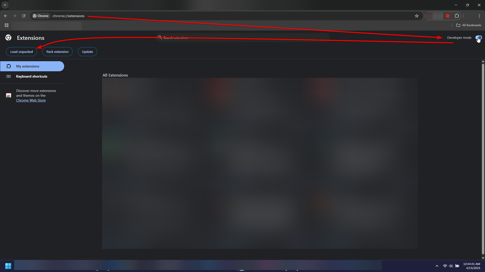
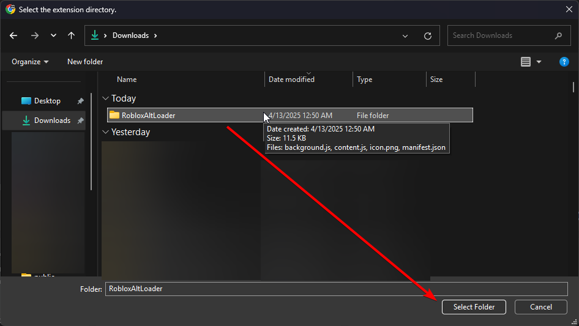

# Roblox Alt Loader

## ⚠️ Requires multi-instancing from [Bloxstrap](https://github.com/bloxstraplabs/bloxstrap) or [Fishtrap](https://github.com/fishstrap/fishstrap) (or any other launcher that supports multi-instancing)

This is a Chrome Extension that allows you to easily run start running another account in the same server as your main account in less than half a minute

## (a) Installing

1. Go to the [releases](https://github.com/calvinzosa/Roblox-Alt-Loader/releases/latest) page and download `RobloxAltLoader.zip`, then extract it to anywhere you want (you can delete the `.zip` file afterwards, but **do not** delete the extracted folder itself).
2. Open [chrome://extensions/](chrome://extensions/) in a new tab.
3. Enable developer mode on the top right.
4. Click `Load unpacked` on the top left.

5. Select the folder to where you extracted the extension to and then click `Select Folder`.

## (b) Usage

1. Pin the extension to your browser by clicking the `Extensions` icon in the top-right corner, then clicking the pin icon on the extension.
2. (Not required if you have your joins set to everyone on your main account) Make sure your alt account is friends with your main account and make sure you are already ingame.
3. Open your profile page: click your profile in the top-left corner of a Roblox page, or manually go `https://www.roblox.com/users/YOUR_USER_ID` (replace `YOUR_USER_ID` with your actual Roblox user ID).
4. Click the extension icon in the top-right corner, however if any issues occur, the extension should display a notification telling you what happened and how to resolve the issue.
5. Log into your alt account (you can use saved passwords). No, I am not going to steal your Roblox account, this is the official Roblox login page, just check the URL bar at the top.
6. The extension will automatically go to your profile, click the `Join` button, then closes the window after 5 seconds, and you should see a new Roblox instance starting to load.

## (c) Updating

1. Open [chrome://extensions/](chrome://extensions/) and click `Remove` on the extension
2. Continue to `(a) Installing`
